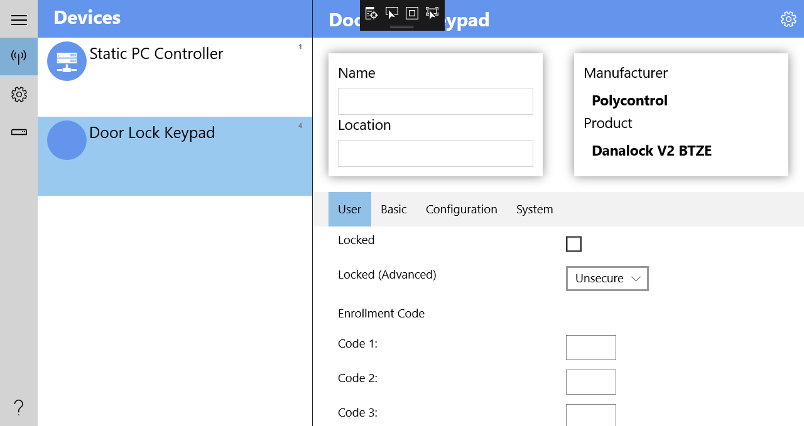

# An Open-ZWave wrapper for use with .NET or UWP apps. Tested with DanaLock V2 Circle.

Forked from https://github.com/dotMorten/openzwave-dotnet-uwp

### Usage

Open src\OpenZWaveUWP.sln

**See instructions** https://github.com/dotMorten/openzwave-dotnet-uwp 

### UWP Sample app with DanaLock:

Works perfectly!